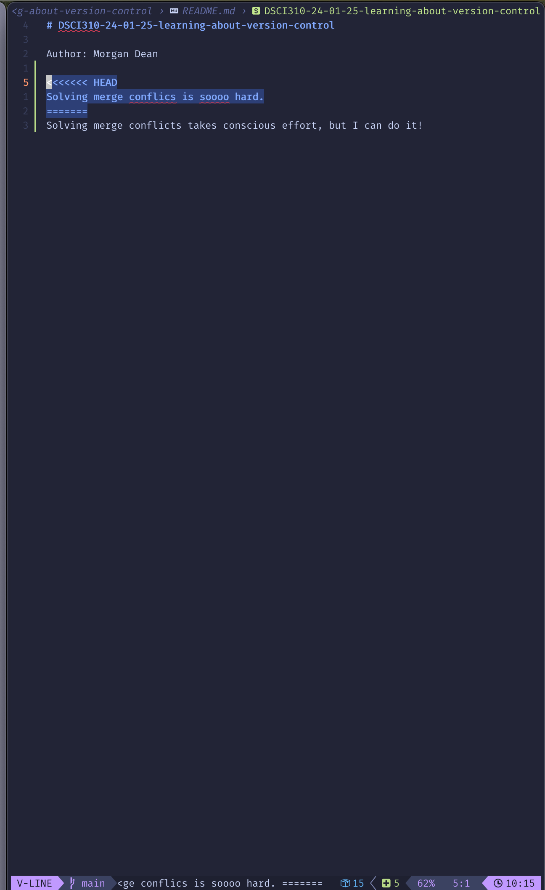

# Github Repo

https://github.commdean808/DSCI310-24-01-25-learning-about-version-control

The branch-pr workflow is helpful for compartmentalizing work on projects so multiple people can make changes to the code for separate purposes and not conflict with each other every time they push to save their work. It also allows for safer CI/CD workflow, if you lock the main repository for only production releases. Making a PR to main would be the only way to update production, forcing code review and testing. It's also easier to keep track of sub-projects within the repo!
